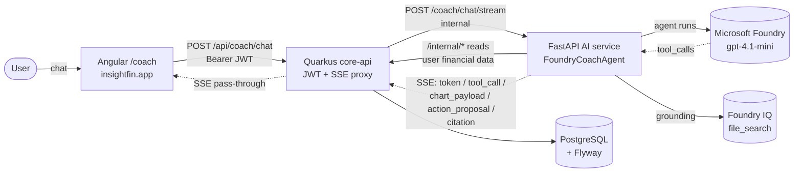
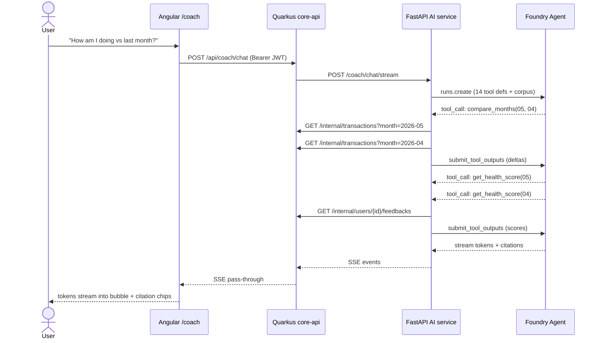

# InsightFin — Financial Coach Agent

[](https://github.com/Estren/insightfin/actions/workflows/core-api.yml)
[](https://github.com/Estren/insightfin/actions/workflows/ai-service.yml)
[](https://github.com/Estren/insightfin/actions/workflows/frontend.yml)
[](LICENSE)

**InsightFin** is a personal finance platform in production at **[insightfin.app](https://insightfin.app)**. This repository is its submission to the **[Microsoft Agents League @ AI Skills Fest 2026](https://aka.ms/AgentsLeague/AISF)** — a conversational **Financial Coach Agent** built on **Microsoft Foundry Agent Service** and grounded with **Foundry IQ**.

> 🎥 **Demo video:** [Watch the 5-minute demo on YouTube](https://youtu.be/rJq0JOWwn_Y)
> 🌐 **Live app:** [insightfin.app](https://insightfin.app) · **API:** [coreapi.insightfin.app/swagger-ui.html](https://coreapi.insightfin.app/swagger-ui.html)
> 🧠 **Track:** Reasoning Agents (Microsoft Foundry) · **Required IQ layer:** Foundry IQ

---

## 🤖 The Financial Coach Agent

Most finance apps show you charts. The Coach reasons over your **real** data and answers like an advisor would — calling tools, citing sources, and holding a multi-turn conversation.

It answers five anchor questions, each requiring multi-step tool calling plus synthesis:

| Question | What the agent does |
| --- | --- |
| "Why did my health score drop this month?" | Pulls the score for this month and last, diffs the breakdown, points at the dimension that fell |
| "Can I spend R$ 800 more on leisure?" | Simulates the budget change, answers yes/no with the projected percentage |
| "Which goal should I prioritize?" | Lists goals with progress and the monthly contribution each needs to hit its deadline |
| "Where can I cut to save R$ 500?" | Surfaces over-limit categories and where the slack is |
| "How am I doing vs last month?" | Computes per-category deltas between the two months |

**Key properties:**

- **Real data, never hallucinated numbers.** Every figure comes from a tool call against the user's live financial data; the prompt forbids rounding or paraphrasing tool output.
- **Grounded answers with citations.** Conceptual questions ("what is the 50/30/20 rule?") are answered from a curated financial-education corpus retrieved via **Foundry IQ**, with inline `[n]` source markers.
- **Acts on data, with explicit consent.** Beyond reading, the agent can _propose_ writes — create a budget, log a transaction, contribute to a goal. Each proposal renders as a confirmation card in the chat; nothing mutates until the user approves, and execution is then handled by a deterministic core-api endpoint with no LLM in the loop.
- **Renders charts inline.** When a visual lands better than prose (an evolution, a category breakdown), the agent emits a line or donut chart that renders inside its own message bubble, theme-reactive to the live `--primary` token.
- **Multi-turn.** Follow-ups like "and how do I fix it?" keep context across the conversation.
- **Multi-conversation.** A ChatGPT-style sidebar of past conversations, persisted across devices.
- **Proactive.** The dashboard detects a blown budget or a low score and offers a one-click "Ask the Coach" prompt that deep-links into a fresh conversation.

The agent lives in `ai/app/coach_agent/`. It is a **new layer** on top of the existing batch-feedback pipeline (`ai/app/agent/`), which keeps running untouched.

## 🧠 Microsoft Foundry integration

The submission uses two layers of Microsoft Foundry:

| Layer | Role in InsightFin |
| --- | --- |
| **Foundry Agent Service** | Hosts the agent (gpt-4.1-mini, region `eastus2`). Owns the reasoning loop, tool-call orchestration, and conversation threads. |
| **Foundry IQ** (`file_search`) | Grounds answers in a curated financial-education corpus spanning **global** investing concepts (compound interest, index funds & ETFs, diversification & asset allocation, dollar-cost averaging, inflation) and **Brazil-specific** topics (Open Finance, Tesouro Direto, the over-indebtedness law, income tax). Answers follow the language of the question and carry inline citations, so advice is sourced rather than invented. |

**Fourteen tools** are exposed to the agent — `user_id` is bound to the session by closure, never as a tool argument, so a prompt-injected message can't read another user's data. They fall into three families:

| Family | Tools | Effect |
| --- | --- | --- |
| **Reads + helpers** | `get_health_score`, `get_transactions`, `get_budget_status`, `get_goals`, `compare_months`, `project_goal_completion`, `simulate_budget_change` | Wrap the platform's existing read endpoints; never mutate. |
| **Write proposals** | `propose_create_budget`, `propose_adjust_budget`, `propose_contribute_goal`, `propose_create_goal`, `propose_log_transaction` | Emit an `action_proposal` SSE event the frontend renders as a confirmation card. The user approves; a deterministic core-api endpoint executes. |
| **Inline charts** | `present_line_chart`, `present_donut_chart` | Emit a `chart_payload` SSE event the frontend renders inside the assistant bubble. Splitting line vs donut into separate tools (instead of one parametric tool) avoids the model inventing the data shape. |

## 🏗️ Architecture

The agent is reached through the existing platform, so it inherits its auth and data.



- Responses **stream** end to end via Server-Sent Events (token, `tool_call`, `chart_payload`, `action_proposal`, `citation`).
- The AI service has **internal ingress only** — the only path to it is through the Quarkus proxy, which holds the JWT trust boundary.
- Conversation **metadata** lives in the platform DB (`coach_threads`); the **messages** live in Foundry threads, so no chat content is duplicated into our database.

### The reasoning loop, end to end

A single anchor prompt usually triggers two or three tool calls before the agent has enough to synthesize an answer. Here's a real trace of _"How am I doing vs last month?"_:



### Hexagonal Architecture (core-api)

```
Request → Adapter (in/web) → UseCase (application) → Domain → Port (out) → Adapter (out/persistence) → Database
```

The platform predates the hackathon, so the agent layer slots in as a new adapter + new port without modifying any existing use case.

## 📦 Monorepo structure

| Directory | Description | Stack |
| --- | --- | --- |
| `core-api/` | Main REST API + Coach SSE proxy — users, transactions, categories, goals, budgets, AI feedback, coach threads | Java 21, Quarkus 3.17, PostgreSQL |
| `ai/` | AI service — batch feedback orchestrator **and** the Foundry Coach Agent | Python 3.12, FastAPI, Azure AI Foundry, azure-ai-projects |
| `frontend/web/` | Web client + the `/coach` chat experience | Angular 21, Tailwind CSS 4, RxJS, ApexCharts |
| `frontend/mobile/` | Reserved for future development | TBD |
| `k8s/` | Kubernetes manifests for a production-like local cluster | — |

## 🛠️ Tech stack

| Layer | Technology |
| --- | --- |
| Coach Agent | Microsoft Foundry Agent Service + Foundry IQ, `azure-ai-projects` 1.0 (gpt-4.1-mini), SSE streaming |
| Backend | Java 21, Quarkus 3.17, Hibernate ORM + Panache, Quarkus REST, JWT (JJWT) |
| Web | Angular 21, Tailwind CSS 4, RxJS, ApexCharts, Playwright (e2e) |
| AI service | Python 3.12, FastAPI, aiohttp, aiokafka, APScheduler, structlog, Prometheus |
| Database | PostgreSQL 16, Flyway migrations |
| Auth | Email/password + Google Sign-In, refresh-token rotation, rate limiting, account lockout |
| Observability | Sentry (frontend + both backends), PostHog product analytics, Prometheus metrics |
| Infra / CI | Docker Compose, Azure Container Apps, Azure Static Web Apps, GitHub Actions (per-service path filters) |

## 🚀 Getting started

### Prerequisites

- [Docker](https://docs.docker.com/get-docker/) & Docker Compose
- [Node.js](https://nodejs.org/) 22+ and npm (web frontend)
- Python 3.12 (AI service, to run the Coach Agent locally)
- An Azure AI Foundry project with a `gpt-4.1-mini` deployment (for the Coach Agent)

### Run the platform

```bash
make up                 # core-api + PostgreSQL + Kafka (+ ai) via Docker Compose
make frontend-install
make frontend-run       # Angular at http://localhost:4200
```

### Run the Coach Agent locally

The agent authenticates to Foundry with `DefaultAzureCredential`, so the AI service runs on the host (where `az login` credentials live), not in the container.

```bash
cd ai
python -m venv .venv && . .venv/Scripts/activate   # Windows; use bin/activate on *nix
python -m pip install -r requirements.txt
az login                                            # Foundry auth

cp .env.example .env                                # fill AZURE_FOUNDRY_PROJECT_ENDPOINT + model
python -m scripts.setup_foundry_iq                  # ingest the corpus → paste the vector store id into .env
python -m scripts.seed_demo_data                    # optional: a demo user with 3 months of data
python main.py                                      # AI service at http://localhost:8081
```

## 🔗 Service URLs (local)

| Service | URL |
| --- | --- |
| Web frontend | `http://localhost:4200` |
| Core API | `http://localhost:8080` |
| Swagger UI | `http://localhost:8080/swagger-ui.html` |
| AI service | `http://localhost:8081` |
| PostgreSQL | `localhost:5432` |
| Prometheus | `http://localhost:9090` |
| Grafana | `http://localhost:3000` (admin / insightfin) |

## 🧪 Testing

- **core-api:** ~198 unit + integration tests (JUnit 5 + Mockito + REST-Assured + H2). Run with `make test-api` or `./mvnw test`.
- **AI service:** pytest suite for the batch orchestrator (`cd ai && pytest`).
- **Frontend:** `npm run build` in CI; Playwright e2e specs under `frontend/web/tests-e2e/`.

CI runs one GitHub Actions workflow per service, scoped by path filter — PRs run the `test` job; pushes to `main` also `deploy`.

## 📄 License

[MIT](LICENSE) © 2026 Thiago Dias
